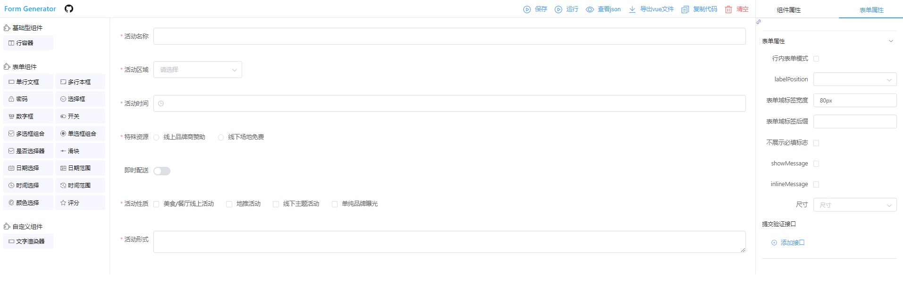

# 表单设计器 

> 参考 [form-generator](https://github.com/JakHuang/form-generator) 设计的一个库

## 基于 element-ui + vue 的表单设计器

演示地址：[https://liar0320.github.io/lich-form-designer/dist](https://liar0320.github.io/lich-form-designer/dist/)

## 使用

```bash
npm i lich-form-designer
```

设计器的使用

```vue
<template>
  <div>
    <lichFormCreator :default-source="source" @change="change" />
  </div>
</template>
<script>
import { lichFormCreator } from "lichFormDesigner";
import { getTemplateJson, selectForm, insertOrUpdateForm } from "../apis";
export default {
  data(){
        return{
            source
        }
  },
  components: {
    lichFormCreator
  },
  methods...
}
```

解析器的使用

```vue
<lichFormParser :formConfig="source.struct" :formData="formData" @onSubmit="onSubmit" />
```

## 项目安装,启动

项目必须依赖 vue 和 element-ui

```
git clone https://github.com/Liar0320/lich-form-designer.git
```

或者你也可以下载 rar 解压

```
npm i
npm run serve | npm run serve:example //demo项目
npm run build:creator //打包表单设计器
npm run build:parser  //打包表单解析器
npm run compileCore   //编译ts源码
```

## 打包

```bash
npm run build
```

## 项目介绍

### 项目展示


